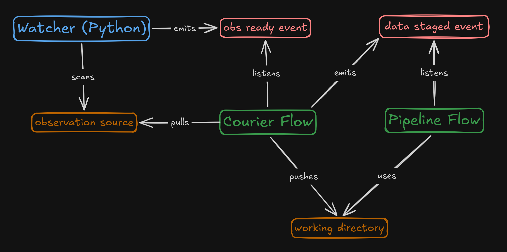

# Event Driven Architecture

This has a notable entry in the [ADR](./adr.md#event-driven-triggering-system)

As mentioned in the [triggering setup](../triggering_setup.md) doc, the pipeline triggering system uses three moving parts that communicate via events:

This setup uses [event-driven architecture](https://en.wikipedia.org/wiki/Event-driven_architecture). Specifically, it uses [Prefect's events system](https://docs.prefect.io/v3/concepts/events). In short, this means that the components do not communicate directly via the API of each other component. Instead they send messages via events. The components listen for particular events and do something when a new one is published.

## Pros

This has a couple of benefits that we are interested in:

- **Loose Coupling** - The components do not hook directly into one another's interfaces. This is nice, as we can separate each working part.
- **Resilience** - Events can occur and wait to be consumed even if one component is down. The event will wait to be consumed when the component is back up and running.
- **Extensibility** - New components can be added to the setup by hooking into events published by the other parts and without making any changes to the existing systems.
- **Independent Scalability** - Components' throughput scales independently from one another. The watcher can find 100 new observations and doesn't have to wait for the courier or the pipeline to finish each one to be processed before notifying about the next.

## Cons

It also has some tradeoffs

- **Complexity** - More complex than calling functions end-to-end
- **Tracing** - Event-driven systems can be harder to trace end-to-end since you lose the simple call stack
